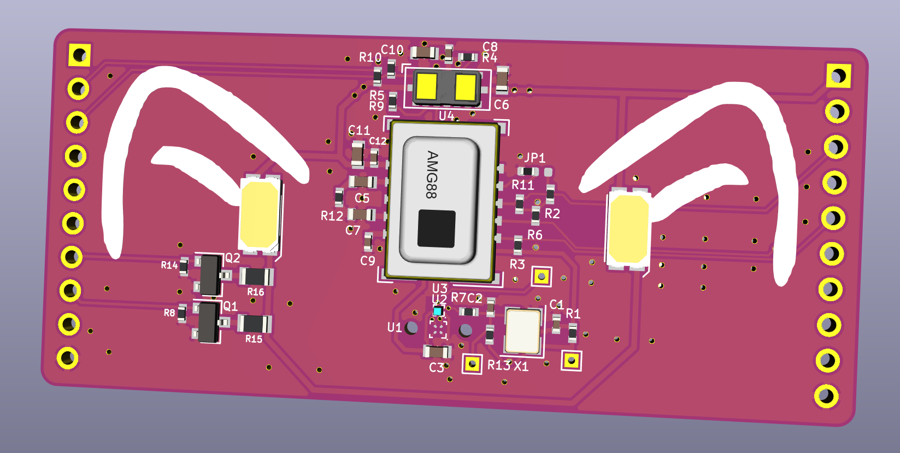
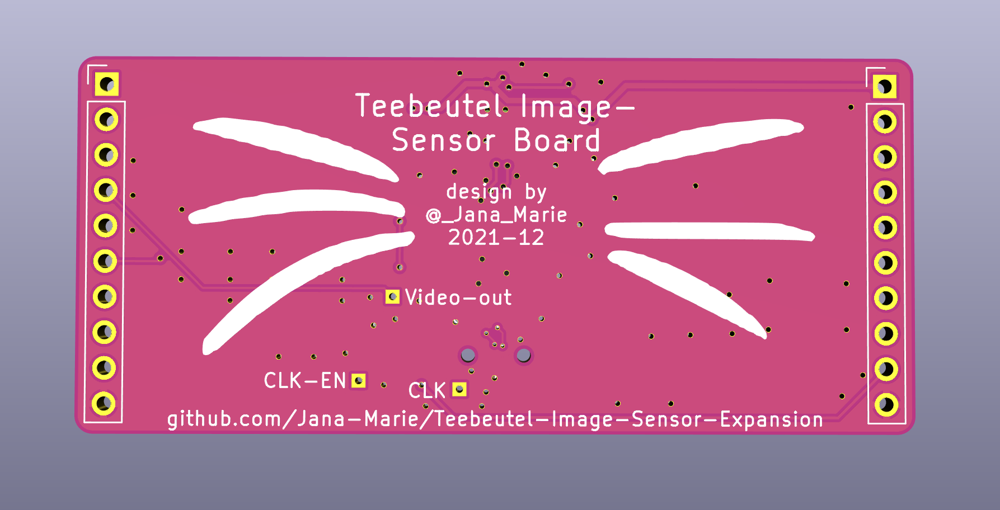

# Teebeutel Image Sensor Expansion

Upgrade your Teebeutel with different wavelength sensitive parts today!

This addon aims to add minimal thermal vision (GridEye, 8x8px, -20..120°C) to your Teebeutel, as well as an optical camera. However the latter is rather a reverse engineering take on Omnivisions OVM6948 and OV6946 sensors. It also adds a 8x8px ToF camera to your Teebeutel.

Nyaaa~
